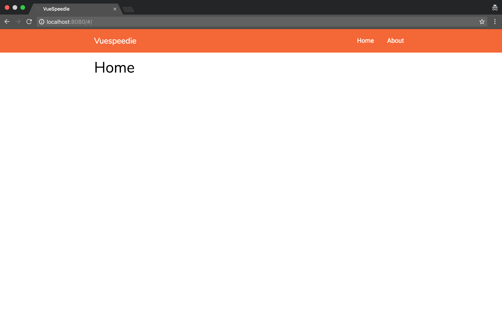

# VueSpeedie

VueSpeedie is a simple [Vue.js](https://github.com/vuejs/vue) powered boilerplate template for building a Single Page Application. You can simply clone the repo, hop over to the [after-clone](#after-clone) section & start builing something huge. 🚀



> Mockup provided by [Pixeden](http://www.pixeden.com/psd-mock-up-templates/the-new-macbook-psd-mockup)

## Features

- [Vue](https://github.com/vuejs/vue) - Clean & powerful reactive library
- [VueRouter](https://github.com/vuejs/vue-router) - The router component powering the SPA
- [Axios](https://github.com/mzabriskie/axios) - Promise based HTTP client for API communication
- [Webpack](https://github.com/webpack/webpack) - Advanced JavaScript module bundler
- [Laravel Mix](https://github.com/JeffreyWay/laravel-mix) - Wrapper around Webpack to get up & running in seconds

## After clone

Now that you have the repository avaible on your machine you can run a few commands and start to code.

### The [yarn](https://github.com/yarnpkg/yarn) way 🐈

``` shell
yarn
yarn run dev
```

### The [npm](https://github.com/npm/npm) way 📦

``` shell
npm i
npm run dev
```
